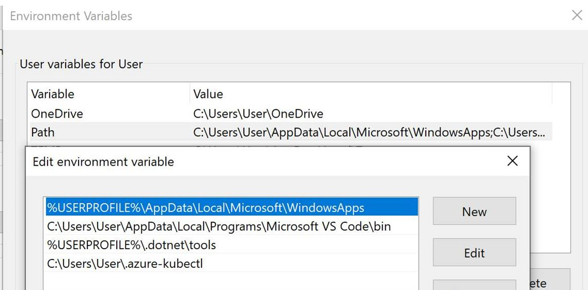

# Challenge 0: Pre-requisites - Ready, Set, GO! 

**[Home](../README.md)** - [Next Challenge >](./01-containers.md)

## Introduction

A smart cloud solution architect always has the right tools in their toolbox. 

## Description

In this challenge we'll be setting up all the tools we will need to complete our challenges.

* Azure CLI 
    * Update to the latest
    * Must be at least version 2.7.x
    * https://docs.microsoft.com/en-us/cli/azure/install-azure-cli-windows?tabs=azure-cli
    * **NOTE:** If you’re running into issues running Azure CLI command on Windows, disable Global Protect (VPN)
* Kubectl
    * Once you have installed Azure CLI the easiest way to install Kubectl is using the Azure CLI to do so:

        ```
        az aks install-cli
        ```

    Follow the instructions on how to configure your path environment variable to include kubectl.exe in your cmd line path. This could look like this on windows (but the output of above command will tell you):

    
* Docker Desktop
  * You can download and install docker from here:
    https://www.docker.com/products/docker-desktop
* NodeJS
    * We will containerize a NodeJS application during the class – so you should install the nodejs tools before hand – the installers can be found here: https://nodejs.org/en/


## Please Install Azure AKS Cluster Beforehand

Finally - since it takes some time to spin up an Azure AKS cluster, it would be ideal to preinstall the cluster before you attend the masterclass (for example the day before)

First you need to login to your Azure account:

```
az login
```

Next make sure that you are using the correct subscription for creating the cluster: 
```
az account list --output table
az account set --subscription <id_of_subscription>
```


Start by creating a ressourcegroup:
```
az group create --location westeurope --resource-group groupname
```

And then you can create the cluster: 

```
az aks create --resource-group <groupname> --name <clustername> --node-count 2  --enable-addons http_application_routing --zones 1 2 --enable-managed-identity
```

